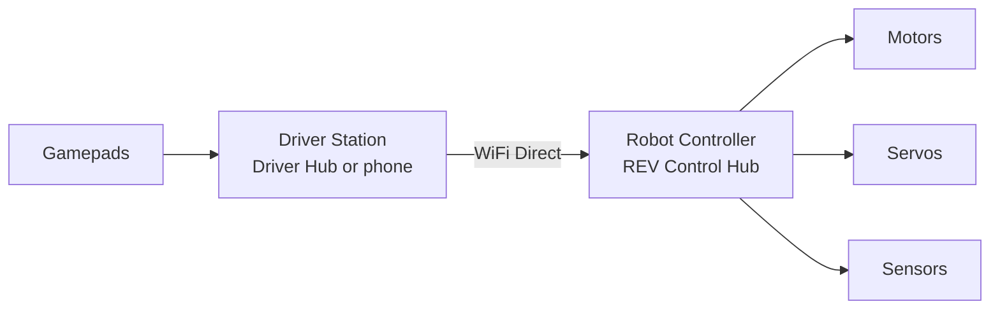

# Level 1 — How an FTC robot actually runs code

## The chain

You write Java → it's built into an app that runs on the **Robot Controller** (the REV Control Hub bolted to the robot) → the **Driver Station** app connects over WiFi Direct and sends gamepad inputs → the Control Hub drives motors, servos, and sensors through its ports.

## Three ways to program, one right answer

=== "Blocks"

    Drag-and-drop in the browser. Fine for week one of ever coding; you'll outgrow it fast.

=== "OnBot Java"

    Write Java in the browser; it compiles on the hub. Zero setup, no version control — okay in a pinch.

=== "Android Studio"

    The full IDE with the real SDK project, Git, and every library. This is what we use. **[FILL IN: confirm/adjust + team-specific setup notes]**

## Setup (before the first workshop)

1. Install Android Studio (free, all platforms). It's heavy — start the download early.
2. Clone the team repo: **[FILL IN: repo URL + how to get access]**. (The official SDK it's built on lives at [github.com/FIRST-Tech-Challenge/FtcRobotController](https://github.com/FIRST-Tech-Challenge/FtcRobotController) — the season's SDK updates land there around kickoff.)
3. Open the project, let Gradle sync (long the first time), and build.
4. Deploying: connect to the Control Hub's WiFi and install over ADB. Our exact ritual: **[FILL IN: network name, password location, wireless ADB command]**

## The configuration — where most first-day pain lives

On the Driver Station, the **robot configuration** maps each physical port to a device **name**. Your code looks devices up by that name, as an exact, case-sensitive string. If the config says `left_drive` and your code says `leftDrive`, the app crashes on init. Our current config names: **[FILL IN: list or screenshot of the active configuration]**

<!-- TODO(phase 2): per SITE-BUILD-PLAN §6 — add one worked "rename a device end-to-end" example
     (config screen → code string → redeploy), and a verify-your-setup checklist exercise
     (task list) that ends in a successful empty build. Budget: 1,000 words. -->

## Go deeper

<!-- TODO(phase 2): ftc-docs hub + configuration pages. -->
